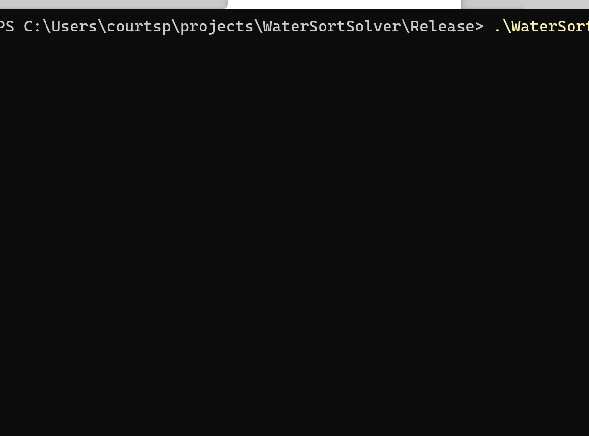

# Solve those Water Sort puzzles

_Why are there so many of them on the app store, anyway? I don't understand!_

## Usage
Edit the inputs in `main()` and then run.
The output tells you the sequence of moves you need to make.

Add the `--animate` flag on the command line for funky animation.
